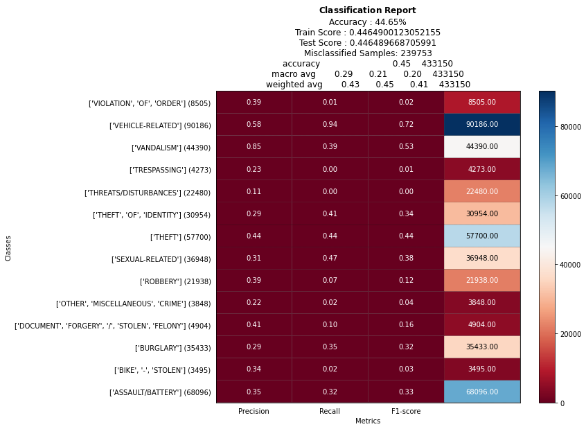

# sybilcastheroku3

------

# SYBILCAST - Coded Predictive Crime Trends

Check out the deployed project [here](https://sybilcastheroku3.herokuapp.com/home)
## Background
**GOAL**: Uniting data and research to forecast danger in Earth's greatest cities.

**HOW**: Implementing the latest innovations in Artificial Intelligence to predict crime.

**SCENARIO**

Let's say you commute the same path to work.

As time goes on, you cycle through the seasons and have a strange feeling that more crimes have been happening on specific times of the year.

**FYI** : Recent studies have shown that temperature and weather can significantly affect crime rates.

## [Crime-Temperature Analysis](https://sybilcastheroku3.herokuapp.com/home)

### Steps

#### Get the Weather Data
- Scrapes lowest temperature in LA and the date it occurred for each year from 2010-2018 from [Current Results - Low Temperatures](https://www.currentresults.com/Yearly-Weather/USA/CA/Los-Angeles/extreme-annual-los-angeles-low-temperature.php) using Splinter and Beautiful Soup. 

- Scrapes highest temperature in LA and the date it occurred for each year from 2010-2018 from [Current Results - High Temperatures](https://www.currentresults.com/Yearly-Weather/USA/CA/Los-Angeles/extreme-annual-los-angeles-high-temperature.php) using Splinter and Beautiful Soup. 

- Calls the [World Weather Online API](https://www.worldweatheronline.com/developer/api/) to get the maximum and minimum temperatures for each day of 2019. Then, finds the highest maximum temperature, the lowest minimum temperature, and the dates that they occured for 2019.

#### Plotly

- Uses javascript, d3, and Plotly to plot the hottest and coldest day of the selected year

- Creates a grouped bar chart that compares the crime count per crime code for the hottest and coldest day of the selected year

- Creates a line graph of the crime count per area of LA of the selected year. A red line indicates that the crime count on the hottest day is greater than the crime count on the coldest day in the corresponding area of LA. A blue line indicates that the crime count on the coldest day is greater than the crime count on the hottest day in the corresponding area of LA

- Creates a time series plot of the crime count per the time of day of the hottest and coldest days of the selected year. Uses a 24-hour clock to show the changes in crime count from time 0 to time 2400

#### Leaflet

- Displays a heatmap of the crime count on the hottest and coldest day of the selected year. User can choose whether to display the heat map for hottest day or the coldest day.


- Displays map of LA with markers of the location of the crime for both the hottest and coldest day. User can choose any year(s) they want to display on the map. On hover, the marker shows the crime description, the military time of the time of occurrence, and the date that the crime occurred.

#### HTML Navigation - HOME

Select a year from 2010-2019 and visualize the data [HERE](https://sybilcastheroku3.herokuapp.com/home).

Select the Predict button to be directed to the [predictions page](https://sybilcastheroku3.herokuapp.com/predictions)

## [Crime Predictions](https://sybilcastheroku3.herokuapp.com/predictions)

### Creating the [Model](SGDmodel_ML) - Steps

#### Data Preprocessing
- Include only Crime Code Description, Area Name, Victim's Age, Victim's Sex, Victim's Descent, Premise Description, Latitude, Longitude, Season, Day or Night from the [dataset](https://data.lacity.org/A-Safe-City/Crime-Data-from-2010-to-2019/63jg-8b9z)
- Drop all crimes with total counts less than 10,000
- Convert the timestamp to:
  -  `Day` : Any timestamp between 5am-5pm
  - `Night` : Any timestamp between 5:01pm-4:49am
  - `Season` : Summer, Winter, Spring, Fall
- Replace any NaN values
  - Replace any NaN values for victim's sex to `X` for unknown
  - Replace any NaN values for victim's descent to `X` for unknown
  - Replace any NaN values for premise description to `Unknown`
- Drop any rows where victim's age is negative or above 114 years old
- Drop any rows where victim's age is 0 and victim's sex is either M or F, to account for victimless crimes
- Replace the remaining rows where victim's age is 0 with the mean age of the dataset (excluding negative ages, 0 ages, and ages above 114)
- Convert the latitude to <a href="https://www.codecogs.com/eqnedit.php?latex=latitude^2" target="_blank"></a>
- Convert the latitude to <a href="https://www.codecogs.com/eqnedit.php?latex=longitude^2" target="_blank"></a>
- Create a Z column : `Z = latitude * longitude`
- Group similar crimes to the following categories: Theft, Assault/Battery, Vehicle-Related, Sexual-Related Crimes, Burglary, Robbery, Threats/Disturbances, Violation of Order
- Final Dataset to feed into SGDClassifier model is loaded to AWS [here](https://crime-bucket.s3.amazonaws.com/FINAL_DF.csv)

#### Model

- ##### Dependencies

  ```python
  from sklearn.model_selection import train_test_split
  from sklearn.preprocessing import StandardScaler
  from sklearn import model_selection
  from sklearn.linear_model import LogisticRegression
  from sklearn import linear_model
  ```

  

- Dummy encode the data using `pd.get_dummies`

- Preform a `train_test_split`

- Scale the data using `StandardScaler()`

- Create the `SGDClassifier` model using logistic regression

  - ```python
    model = linear_model.SGDClassifier(loss='log',max_iter=500,verbose=2)
    ```

- Fit the model

#### Model Evaluation 




#### HTML Navigation - PREDICTIONS
Enter your information and recieve the probabilities of the most likely crimes to occur to you

See examples of people's information and what crimes are predicted to occur to them

## [Data Analysis and Visualizations](https://sybilcastheroku3.herokuapp.com/tableau)
#### HTML Navigation - VISUALIZATIONS
Explore Tableau visualizations that:
- Compares crime count for each season
- Explores the relationship between season and premise description
- Explores the relationship between Area Name and day verses night
- Compares victim descent by season and crime count
- Compares different crimes based on victim's age
- Compares different crimes based on victim's sex
